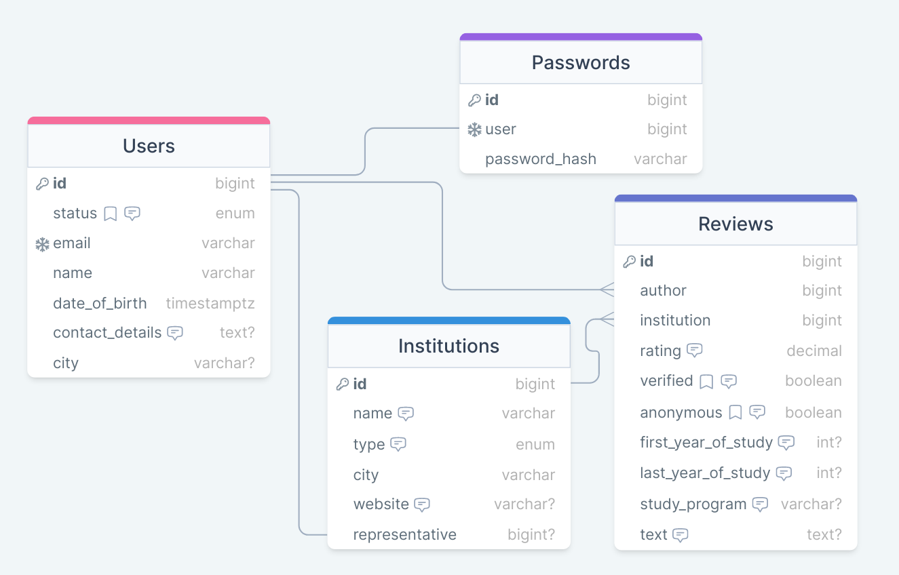

# Askas API Documentation

## Database schema

[](https://drawsql.app/teams/askas/diagrams/askas-db)
[DrawSQL link](https://drawsql.app/teams/askas/diagrams/askas-db)

## Endpoints

### Authorization

- `/auth/sign_up/`</br>
	- **POST**:
		- permissions: all
		- body:
			```json
			{
				"email": "string",
				"password": "string",
				"name": "string",
				"date_of_birth": "string (timestamptz)",
				"contact_details": "string | null",
				"city": "string | null"
			}
			```
	- **response**:
		- 200 OK:
			```json
			{
				"id": "int",
				"email": "string",
				"status": "string (user | admin | official)",
				"name": "string",
				"date_of_birth": "string (timestamptz)",
				"contact_details": "string | null",
				"city": "string | null"
			}
			```
        - 400 BadRequest:
    		- Request must contain email, password, name and date_of_birth fields
				```json
				{
					"error": "email is not specified"
				}
				```
				or
				```json
				{
					"error": "password is not specified"
				}
				```
				or
				```json
				{
					"error": "name is not specified"
				}
				```
				or
				```json
				{
					"error": "date of birth is not specified"
				}
				```
			- Email must be unique
				```json
				{
					"error": "user with specified email already exists"
				}
				```
			- Email must be valid
				```json
				{
					"error": "specified email is not valid"
				}
				```
			- Date of birth must be valid (0 <= x <= 200)
				```json
				{
					"error": "specified date_of_birth is not valid"
				}
				```
			- Name must not be empty
				```json
				{
					"error": "name must not be empty"
				}
				```
			- Password must be valid
				```json
				{
					"error": "password must be at least 8 characters long"
				}
				```
				or
				 ```json
				{
					 "error": "password must contain both lowercase and uppercase characters"
				}
				```
				or
				```json
				{
					"error": "password must contain digits 0-9"
				}
				```
				or
				```json
				{
					"error": "password must contain special characters '!@#$%&*'"
				}
				```

- `/auth/sign_in/`</br>
    - **request**:
        - body: 
            ```json
            {
                "email": "string",
                "password": "string"
            }
            ```
    - **response**:
        - 200 OK:
            ```json
            {
                "accessToken": "string",
                "refreshToken": "string"
            }
            ```
        - 400 BadRequest:
            - Request must contain both fields
                ```json
                {
                    "error": "email is not specified"
                }
                ```
                or
                ```json
                {
                    "error": "password is not specified"
                }
                ```
        - 403 Forbidden:
            ```json
            {
                "error": "user with this credentials does not exist"
            }
            ```

- `/auth/refresh/`</br>
	- **request**:
		- body:
			```json
			{
				"refreshToken": "string"
			}
			```
	- **response**
		- 200 OK:
			```json
			{
				"accessToken": "string"
			}
			```
		- 401 Unauthorized:
			- Token expired
			```json
			{
				"error": "token expired"
			}
			```
			- Wrong token
			```json
			{
				"error": "wrong token"
			}
			```
