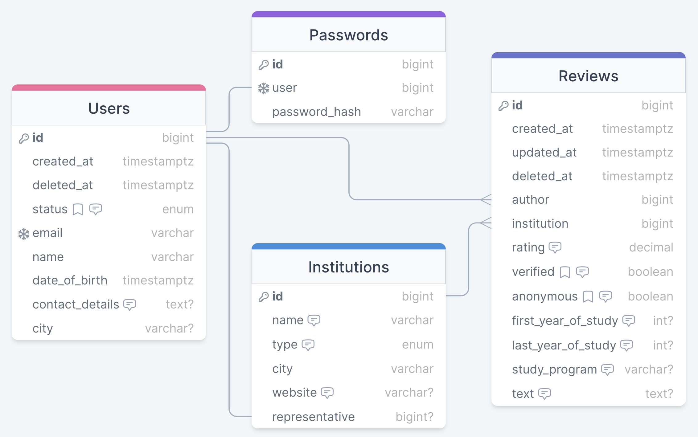

# Askas API Documentation

## Database schema

[](https://drawsql.app/teams/askas/diagrams/askas-db)
[DrawSQL link](https://drawsql.app/teams/askas/diagrams/askas-db)

## Endpoints

### List of endpoints
- [Authorization](#authorization)
	- [**POST** `/auth/sign_in/`](#post-authsign_in)
	- [**POST** `/auth/refresh/`](#post-authrefresh)
- [Users](#users)
	- [**POST** `/users/`](#post-users-create-new-user)
	- [**GET** `/users/me`](#get-usersme)
	- [**PATCH** `/users/me`](#patch-usersme)
	- [**DELETE** `/users/me`](#delete-usersme)
	- [**POST** `/users/me/changePassword`](#post-usersmechangepassword)
	- [**GET** `/users/:id`](#get-usersid)
	- [**POST** `/users/createOfficial`](#post-userscreateofficial)
- [Institutions](#institutions)
	- [**POST** `/institutions/`](#post-institutions-create-new-institution)
	- [**PATCH** `/institutions/:id`](#patch-institutionsid)
	- [**DELETE** `/institutions/:id`](#delete-institutionsid)
- [Reviews](#reviews)
	- [**POST** `/reviews/`](#post-reviews-create-new-review)
	- [**PATCH** `/reviews/:id`](#patch-reviewsid)
	- [**DELETE** `/reviews/:id`](#delete-reviewsid)

### Authorization

#### **POST** `/auth/sign_in/`
permissions: all
- body: 
```json
{
	"email": "string",
	"password": "string"
}
```

**response**:

200 OK:
```json
{
	"accessToken": "string",
	"refreshToken": "string"
}
```
400 BadRequest:
- Request must contain both fields
```json
{
	"error": "email is not specified"
}
```
or
```json
{
	"error": "password is not specified"
}
```
403 Forbidden:
```json
{
	"error": "user with this credentials does not exist"
}
```

#### **POST** `/auth/refresh/`
permissions: all
- body:
```json
{
	"refreshToken": "string"
}
```

**response**

200 OK:
```json
{
	"accessToken": "string",
	"refreshToken": "string"
}
```
401 Unauthorized:
- Token expired
```json
{
	"error": "token expired"
}
```
- Wrong token
```json
{
	"error": "wrong token"
}
```

### Users

#### **POST** `/users/` (create new user)
permissions: all
- body:
```json
{
	"email": "string",
	"password": "string",
	"name": "string",
	"date_of_birth": "string (timestamptz)",
	"contact_details": "string | null",
	"city": "string | null"
}
```

**response**:

200 OK:
```json
{
	"id": "int",
	"created_at": "string",
	"deleted_at": "string",
	"email": "string",
	"status": "string (user | admin | official)",
	"name": "string",
	"date_of_birth": "string (timestamptz)",
	"contact_details": "string | null",
	"city": "string | null"
}
```
400 BadRequest:
- Request must contain email, password, name and date_of_birth fields
```json
{
	"error": "email is not specified"
}
```
or
```json
{
	"error": "password is not specified"
}
```
or
```json
{
	"error": "name is not specified"
}
```
or
```json
{
	"error": "date of birth is not specified"
}
```
- Email must be unique
```json
{
	"error": "user with specified email already exists"
}
```
- Email must be valid
```json
{
	"error": "specified email is not valid"
}
```
- Date of birth must be valid (0 <= x <= 200)
```json
{
	"error": "specified date_of_birth is not valid"
}
```
- Name must not be empty
```json
{
	"error": "name must not be empty"
}
```
- Password must be valid
```json
{
	"error": "password must be at least 8 characters long"
}
```
or
```json
{
	"error": "password must contain both lowercase and uppercase characters"
}
```
or
```json
{
	"error": "password must contain digits 0-9"
}
```
or
```json
{
	"error": "password must contain special characters '!@#$%&*'"
}
```

#### **GET** `/users/me`
permissions: authorized (user/admin/official)
- headers:
```json
{
	"Authorization": "Bearer {{ accessToken }}"
}
```

**response**

200 OK:
```json
{
	"id": "int",
	"created_at": "string",
	"deleted_at": "string",
	"email": "string",
	"status": "string (user | admin | official)",
	"name": "string",
	"date_of_birth": "string (timestamptz)",
	"contact_details": "string | null",
	"city": "string | null"
}
```
401 Unauthorized:
- Token expired
```json
{
	"error": "token expired"
}
```
- Wrong token
```json
{
	"error": "wrong token"
}
```
404 NotFound:
```json
{
	"error": "user does not exist"
}
```

#### **PATCH** `/users/me`
permissions: authorized (user/admin/official)
- headers:
```json
{
	"Authorization": "Bearer {{ accessToken }}"
}
```
- body:
```json
{
	"email?": "string",
	"name?": "string",
	"date_of_birth?": "string (timestamptz)",
	"contact_details?": "string | null",
	"city?": "string | null"
}
```

**response**

200 OK:
```json
{
	"id": "int",
	"created_at": "string",
	"deleted_at": "string",
	"email": "string",
	"status": "string (user | admin | official)",
	"name": "string",
	"date_of_birth": "string (timestamptz)",
	"contact_details": "string | null",
	"city": "string | null"
}
```
400 BadRequest:
- Email must be unique
```json
{
	"error": "user with specified email already exists"
}
```
- Email must be valid
```json
{
	"error": "specified email is not valid"
}
```
- Date of birth must be valid (0 <= x <= 200)
```json
{
	"error": "specified date_of_birth is not valid"
}
```
- Name must not be empty
```json
{
	"error": "name must not be empty"
}
```
401 Unauthorized:
- Token expired
```json
{
	"error": "token expired"
}
```
- Wrong token
```json
{
	"error": "wrong token"
}
```
404 NotFound:
```json
{
	"error": "user does not exist"
}
```

#### **DELETE** `/users/me`
permissions: user | admin
- headers:
```json
{
	"Authorization": "Bearer {{ accessToken }}"
}
```

**response**:

204 NoContent:
```json
{
	"message": "account deleted succesfully"
}
```
404 NotFound:
```json
{
	"error": "user not found"
}
```

#### **POST** `/users/me/changePassword`
permissions: authorized (user/admin/official)
- headers:
```json
{
	"Authorization": "Bearer {{ accessToken }}"
}
```
- body:
```json
{
	"old_password": "string",
	"new_password": "string"
}
```

**response**

200 OK:
```json
{
	"message": "password updated successfully"
}
```
400 BadRequest:
- Password must be valid
```json
{
	"error": "password must be at least 8 characters long"
}
```
or
```json
{
	"error": "password must contain both lowercase and uppercase characters"
}
```
or
```json
{
	"error": "password must contain digits 0-9"
}
```
or
```json
{
	"error": "password must contain special characters '!@#$%&*'"
}
```
401 Unauthorized:
- Token expired
```json
{
	"error": "token expired"
}
```
- Wrong token
```json
{
	"error": "wrong token"
}
```
403 Forbidden:
```json
{
	"error": "wrong old password"
}
```
404 NotFound:
```json
{
	"error": "user does not exist"
}
```

#### **GET** `/users/:id`
permissions: authorized (user/admin/official)
- headers:
```json
{
	"Authorization": "Bearer {{ accessToken }}"
}
```

**response**

200 OK:
```json
{
	"id": "int",
	"created_at": "string",
	"deleted_at": "string",
	"status": "string (user | admin | official)",
	"name": "string",
	"date_of_birth": "string (timestamptz)",
	"contact_details": "string | null",
	"city": "string | null"
}
```
401 Unauthorized:
- Token expired
```json
{
	"error": "token expired"
}
```
- Wrong token
```json
{
	"error": "wrong token"
}
```
404 NotFound:
```json
{
	"error": "user does not exist"
}
```

#### **POST** `/users/createOfficial`
permissions: admin
- headers:
```json
{
	"Authorization": "Bearer {{ accessToken }}"
}
```
- body:
```json
{
	"email": "string",
	"institution": "number"
}
```

**response**:

200 OK:
```json
{
	"id": "int",
	"created_at": "string",
	"deleted_at": "string",
	"email": "string",
	"status": "string (official)",
	"name": "string (institution.name + '-official')",
	"password": "string (random)"
}
```
400 BadRequest:
- Email must be unique
```json
{
	"error": "user with specified email already exists"
}
```
- Email must be valid
```json
{
	"error": "specified email is not valid"
}
```
401 Unauthorized:
- Token expired
```json
{
	"error": "token expired"
}
```
- Wrong token
```json
{
	"error": "wrong token"
}
```
403 Forbidden:
```json
{
	"error": "you do not have permission for this action"
}
```
404 NotFound:
```json
{
	"error": "institution does not exist"
}
```

### Institutions

#### **POST** `/institutions/` (create new institution)
permissions: admin
- headers:
```json
{
	"Authorization": "Bearer {{ accessToken }}"
}
```
- body:
```json
{
	"name": "string",
	"type": "string (school | university | college)",
	"city": "string",
	"website": "string | null"
}
```

**response**:

200 OK:
```json
{
	"id": "int",
	"name": "string",
	"type": "string (school | university | college)",
	"city": "string",
	"website": "string | null",
	"representative": "number | null"
}
```
400 BadRequest
- Type must take one of three values: school, university or college
```json
{
	"error": "type must be 'school', 'university' or 'college'"
}
```

#### **PATCH** `/institutions/:id`
permissions: admin
- headers:
```json
{
	"Authorization": "Bearer {{ accessToken }}"
}
```
- body:
```json
{
	"name?": "string",
	"type?": "string (school | university | college)",
	"city?": "string",
	"website?": "string | null"
}
```

**response**:

200 OK:
```json
{
	"id": "int",
	"name": "string",
	"type": "string (school | university | college)",
	"city": "string",
	"website": "string | null",
	"representative": "number | null"
}
```
400 BadRequest
- Type must take one of three values: school, university or college
```json
{
	"error": "type must be 'school', 'university' or 'college'"
}
```

#### **DELETE** `/institutions/:id`
permissions: admin
- headers:
```json
{
	"Authorization": "Bearer {{ accessToken }}"
}
```

**response**:

204 NoContent:
```json
{
	"message": "institution deleted succesfully"
}
```
404 NotFound:
```json
{
	"error": "review not found"
}
```

### Reviews

#### **POST** `/reviews/` (create new review)
permissions: user | admin
- headers:
```json
{
	"Authorization": "Bearer {{ accessToken }}"
}
```
- body:
```json
{
	"institution": "number",
	"rating": "number",
	"anonymous": "bool",
	"first_year_of_study": "number | null",
	"last_year_of_study": "number | null",
	"study_program": "string | null",
	"text": "string | null"
}
```

**response**:

200 OK:
```json
{
	"id": "int",
	"created_at": "string",
	"updated_at": "string",
	"deleted_at": "string",
	"author": "number",
	"institution": "number",
	"rating": "number",
	"verified": "bool",
	"anonymous": "bool",
	"first_year_of_study": "number | null",
	"last_year_of_study": "number | null",
	"study_program": "string | null",
	"text": "string | null"
}
```
400 BadRequest:
- Rating must be a decimal value between 0.0 and 5.0
```json
{
	"error": "rating must be a decimal value between 0.0 and 5.0"
}
```
- Years of study must be valid (first < last, first <= current_year)
```json
{
	"error": "years of study are invalid"
}
```
- User can post only one review per institution
```json
{
	"error": "you can post only one review per institution"
}
```
403 Forbidden:
```json
{
	"error": "you do not have permission for this action"
}
```
404 NotFound:
```json
{
	"error": "institution does not exist"
}
```

#### **PATCH** `/reviews/:id`
permissions: user | admin (only if user == review.author)
- headers:
```json
{
	"Authorization": "Bearer {{ accessToken }}"
}
```
- body:
```json
{
	"rating?": "number",
	"anonymous?": "bool",
	"first_year_of_study?": "number | null",
	"last_year_of_study?": "number | null",
	"study_program?": "string | null",
	"text?": "string | null"
}
```

**response**:

200 OK:
```json
{
	"id": "int",
	"created_at": "string",
	"updated_at": "string",
	"deleted_at": "string",
	"author": "number",
	"institution": "number",
	"rating": "number",
	"verified": "bool",
	"anonymous": "bool",
	"first_year_of_study": "number | null",
	"last_year_of_study": "number | null",
	"study_program": "string | null",
	"text": "string | null"
}
```
400 BadRequest:
- Rating must be a decimal value between 0.0 and 5.0
```json
{
	"error": "rating must be a decimal value between 0.0 and 5.0"
}
```
- Years of study must be valid (first < last, first <= current_year)
```json
{
	"error": "years of study are invalid"
}
```
403 Forbidden:
```json
{
	"error": "you do not have permission for this action"
}
```

#### **DELETE** `/reviews/:id`
permissions: user | admin (only if user == review.author)
- headers:
```json
{
	"Authorization": "Bearer {{ accessToken }}"
}
```

**response**:

204 NoContent:
```json
{
	"message": "review deleted succesfully"
}
```
404 NotFound:
```json
{
	"error": "review not found"
}
```
